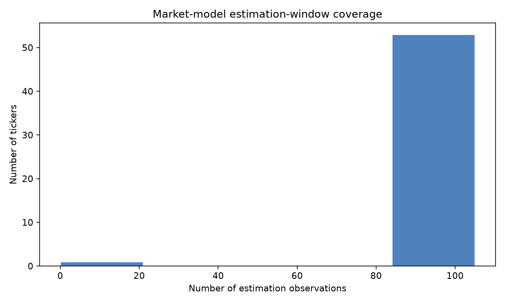
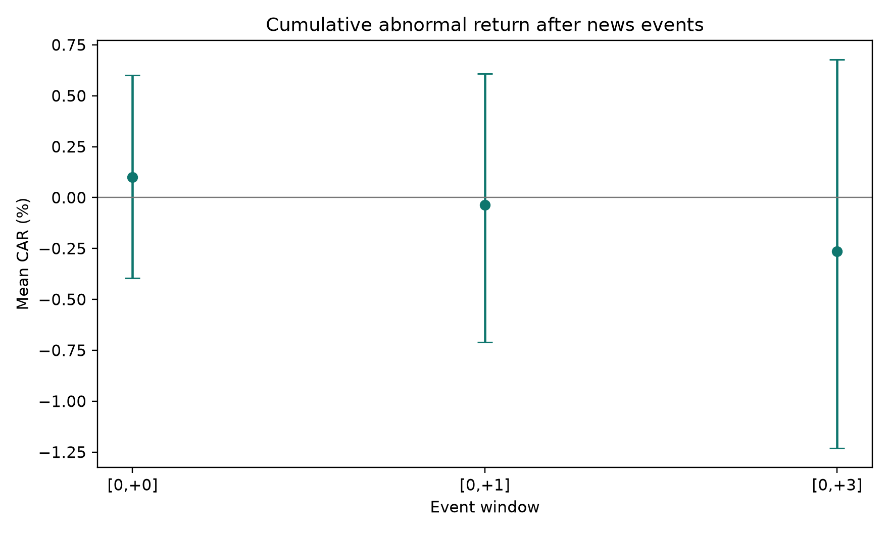
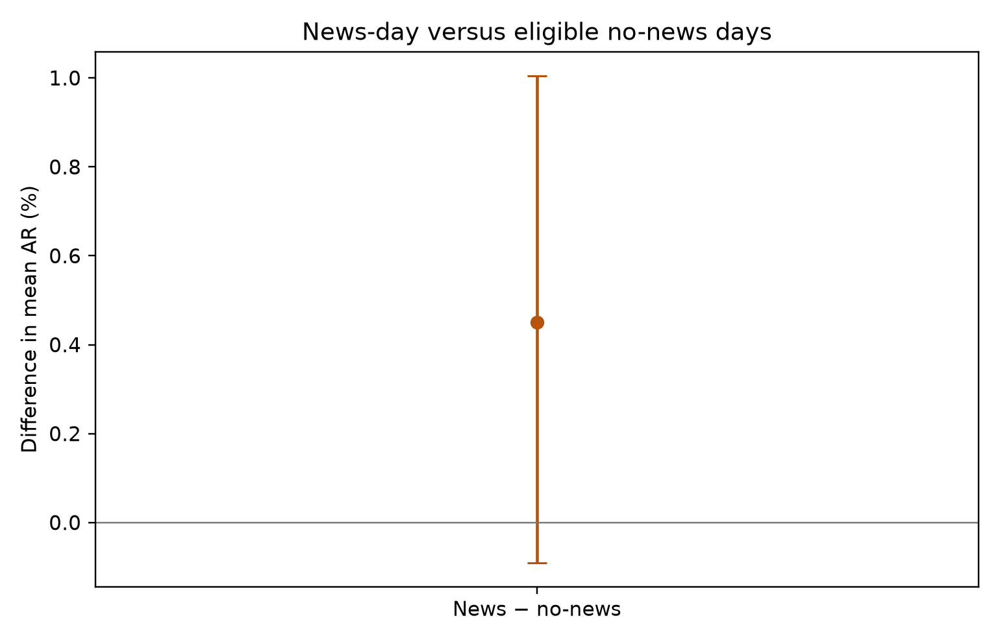
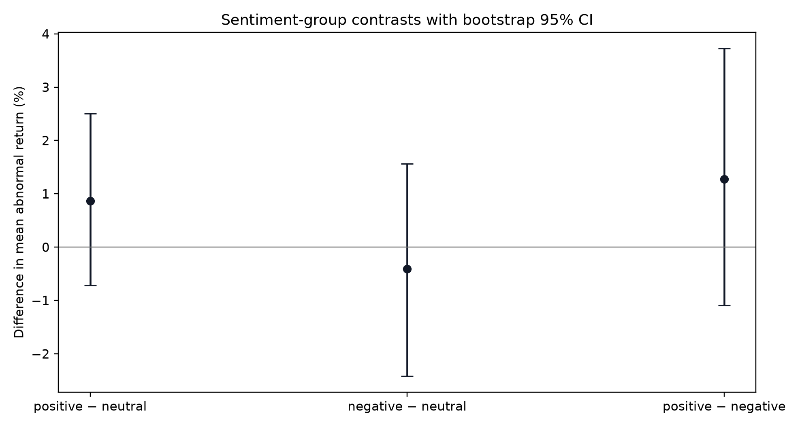
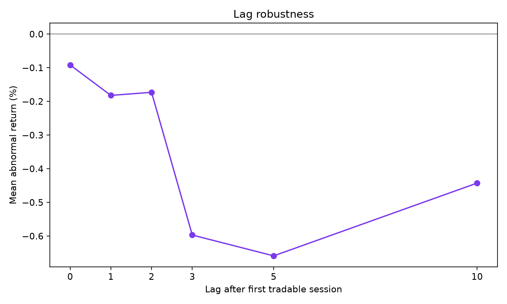
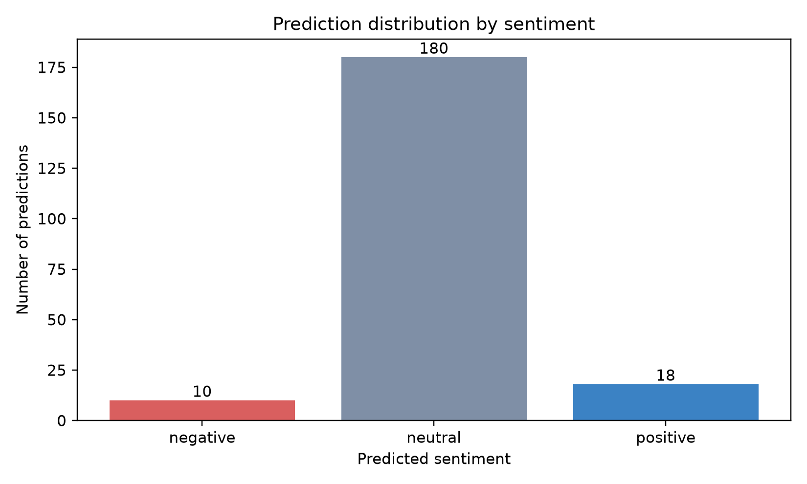

# CafeF–FinABSA Validation Report

> Báo cáo này được sinh tự động từ các file dữ liệu và kết quả trong repository. Kết quả downstream là association ngoài mẫu, không phải bằng chứng nhân quả hay khuyến nghị đầu tư.

## 1. Executive summary

Pipeline đã xử lý **208** dòng input và **208** prediction; số label không parse được là **0**. Đơn vị inference là article–ticker, còn đơn vị panel là ticker–ngày để tránh lặp lại abnormal return khi có nhiều bài về cùng mã trong một ngày.

Báo cáo này bao gồm validation prediction, phân bố sentiment, event-study summary, kiểm định chênh lệch giữa các nhóm sentiment, panel regression, lag robustness, market-model coverage và toàn bộ biểu đồ được sinh từ cùng các file intermediate.

## 2. Prediction validation

|   input_rows |   prediction_rows |   missing_predictions |   unexpected_predictions |   unknown_labels |
|-------------:|------------------:|----------------------:|-------------------------:|-----------------:|
|          208 |               208 |                     0 |                        0 |                0 |

```json
{
  "input_rows": 208,
  "prediction_rows": 208,
  "missing_predictions": 0,
  "unexpected_predictions": 0,
  "duplicate_input_ids": 0,
  "duplicate_prediction_ids": 0,
  "unknown_labels": 0,
  "label_counts": {
    "neutral": 180,
    "positive": 18,
    "negative": 10
  }
}
```

### Prediction distribution

| label    |   count |
|:---------|--------:|
| negative |      10 |
| neutral  |     180 |
| positive |      18 |

## 3. Data and market coverage

Số ngày aggregate: **21**. Số ticker có market model: **54**. Panel regression có **152** quan sát, **51** ticker và **21** ngày; đơn vị là **ticker-day**.

| ticker   |   alpha |    beta |   n_estimation | model_status   |
|:---------|--------:|--------:|---------------:|:---------------|
| ACB      |  0.0288 |  0.9434 |            105 | market_model   |
| AMD      | -0.6832 |  1.4887 |            105 | market_model   |
| BID      |  0.1454 |  1.4112 |            105 | market_model   |
| BIG      | -0.3924 |  0.3397 |            105 | market_model   |
| CEN      | -0.2903 |  1.1666 |            105 | market_model   |
| CTG      |  0.0958 |  1.4386 |            105 | market_model   |
| DGC      | -0.0688 |  1.5952 |            105 | market_model   |
| DIG      | -0.2028 |  1.7626 |            105 | market_model   |
| DNP      |  0.0483 | -0.0055 |             99 | market_model   |
| DXG      | -0.2254 |  1.7109 |            105 | market_model   |
| EIB      |  0.1702 |  0.1483 |            105 | market_model   |
| FLC      | -0.7855 |  1.5124 |             89 | market_model   |
| FTS      |  0.1854 |  1.8623 |            105 | market_model   |
| GAS      |  0.2293 |  1.1169 |            105 | market_model   |
| GEX      | -0.049  |  1.7771 |            105 | market_model   |
| HAG      |  0.4616 |  1.1152 |            105 | market_model   |
| HBC      |  0.0116 |  1.5022 |            105 | market_model   |
| HCM      |  0.2349 |  1.681  |            105 | market_model   |
| HDB      |  0.1528 |  1.112  |            105 | market_model   |
| HDC      | -0.0407 |  1.6777 |            105 | market_model   |
| HPG      | -0.2097 |  1.0532 |            105 | market_model   |
| HSG      | -0.1268 |  1.4914 |            105 | market_model   |
| ICT      |  0.1137 |  0.4238 |            105 | market_model   |
| ITA      | -0.5754 |  1.5134 |            105 | market_model   |
| KBC      |  0.1289 |  1.3851 |            105 | market_model   |
| LHG      | -0.1524 |  1.5908 |            105 | market_model   |
| LPB      | -0.0106 |  1.4453 |            105 | market_model   |
| MBS      |  0.1213 |  2.1671 |            105 | market_model   |
| MSH      | -0.2744 |  1.2546 |            105 | market_model   |
| MWG      |  0.0632 |  1.2326 |            105 | market_model   |



## 4. Event-study results

| label    |   events |   mean_sentiment |   mean_return |   mean_abnormal_return |   median_abnormal_return |   mean_article_count |
|:---------|---------:|-----------------:|--------------:|-----------------------:|-------------------------:|---------------------:|
| negative |       10 |               -1 |       -1.4767 |                -0.3665 |                  -1.2829 |               1      |
| neutral  |      172 |                0 |       -0.8231 |                 0.1105 |                   0.1322 |               1.3081 |
| positive |       18 |                1 |        0.3498 |                 1.1637 |                   0.9237 |               1.3333 |


### Panel-level summary

| label    |   panel_events |   mean_sentiment |   mean_abnormal_return |   median_abnormal_return |   mean_article_count |   mean_event_rows |
|:---------|---------------:|-----------------:|-----------------------:|-------------------------:|---------------------:|------------------:|
| negative |             10 |          -1      |                -0.3665 |                  -1.2829 |               1      |            1      |
| neutral  |            139 |           0.0086 |                 0.0402 |                  -0.0655 |               1.2302 |            1.2374 |
| positive |             15 |           0.9    |                 0.9068 |                   0.4796 |               1.2    |            1.2    |

## 5. News-price reaction tests

Phần này kiểm tra trực tiếp liệu các event news có đi kèm phản ứng giá bất thường hay không. `CAR` là tổng abnormal return trong cửa sổ sau ngày event. Kiểm định t một mẫu và sign-flip permutation test kiểm tra CAR trung bình có khác 0; bootstrap cung cấp khoảng tin cậy 95% cho effect size.

| window   |   window_key | group    |   n |   mean_car |   median_car |   t_stat |    t_p |   sign_flip_p |   bootstrap_ci_low |   bootstrap_ci_high |
|:---------|-------------:|:---------|----:|-----------:|-------------:|---------:|-------:|--------------:|-------------------:|--------------------:|
| [0,+0]   |          0_0 | all      | 152 |     0.099  |      -0.0337 |   0.3824 | 0.7027 |        0.6937 |            -0.3944 |              0.601  |
| [0,+0]   |          0_0 | negative |  10 |    -0.3665 |      -1.2829 |  -0.3542 | 0.7314 |        0.7351 |            -2.2612 |              1.5844 |
| [0,+0]   |          0_0 | neutral  | 127 |     0.0402 |      -0.0655 |   0.1416 | 0.8876 |        0.8902 |            -0.5153 |              0.5901 |
| [0,+0]   |          0_0 | positive |  15 |     0.9068 |       0.4796 |   1.1224 | 0.2806 |        0.2835 |            -0.5604 |              2.4571 |
| [0,+1]   |          0_1 | all      | 152 |    -0.0369 |       0.0918 |  -0.1064 | 0.9154 |        0.9152 |            -0.7098 |              0.6092 |
| [0,+1]   |          0_1 | negative |  10 |     0.1044 |      -0.4044 |   0.1019 | 0.9211 |        0.9098 |            -1.7411 |              2.0379 |
| [0,+1]   |          0_1 | neutral  | 127 |     0.1073 |       0.2594 |   0.2725 | 0.7857 |        0.7886 |            -0.655  |              0.8759 |
| [0,+1]   |          0_1 | positive |  15 |    -1.3522 |      -1.6099 |  -1.5819 | 0.136  |        0.1314 |            -2.9966 |              0.3553 |
| [0,+3]   |          0_3 | all      | 152 |    -0.2649 |      -0.6823 |  -0.5407 | 0.5895 |        0.5971 |            -1.2305 |              0.6768 |
| [0,+3]   |          0_3 | negative |  10 |    -2.6645 |      -2.865  |  -1.2247 | 0.2518 |        0.2492 |            -6.6793 |              1.2969 |
| [0,+3]   |          0_3 | neutral  | 127 |     0.1476 |       0.0022 |   0.2741 | 0.7845 |        0.7784 |            -0.8815 |              1.209  |
| [0,+3]   |          0_3 | positive |  15 |    -2.1575 |      -1.9846 |  -1.7703 | 0.0984 |        0.0978 |            -4.4665 |              0.1626 |



### News-day versus no-news-day control

| comparison                 |   n_news |   n_no_news |   mean_news_ar |   mean_no_news_ar |   difference |   welch_t |   welch_p |   permutation_p |   bootstrap_ci_low |   bootstrap_ci_high |
|:---------------------------|---------:|------------:|---------------:|------------------:|-------------:|----------:|----------:|----------------:|-------------------:|--------------------:|
| news_day_minus_no_news_day |      152 |         934 |          0.099 |           -0.3509 |       0.4499 |     1.617 |    0.1074 |          0.0988 |            -0.0901 |               1.004 |



## 6. Sentiment-group tests

Các group tests dùng đơn vị ticker–ngày. `difference` là mean AR của group A trừ group B; p-value Welch là kiểm định tham khảo, permutation p-value không dựa trên giả định chuẩn, còn bootstrap CI thể hiện độ bất định của effect size.

| comparison              | group_a   | group_b   |   n_a |   n_b |   mean_a |   mean_b |   difference |   welch_t |   welch_p |   permutation_p |   bootstrap_ci_low |   bootstrap_ci_high |
|:------------------------|:----------|:----------|------:|------:|---------:|---------:|-------------:|----------:|----------:|----------------:|-------------------:|--------------------:|
| positive_minus_neutral  | positive  | neutral   |    15 |   127 |   0.9068 |   0.0402 |       0.8666 |    1.0118 |    0.3253 |          0.3177 |            -0.7168 |              2.5064 |
| negative_minus_neutral  | negative  | neutral   |    10 |   127 |  -0.3665 |   0.0402 |      -0.4068 |   -0.379  |    0.7123 |          0.7079 |            -2.4133 |              1.5643 |
| positive_minus_negative | positive  | negative  |    15 |    10 |   0.9068 |  -0.3665 |       1.2733 |    0.9699 |    0.3444 |          0.3337 |            -1.0868 |              3.7216 |



## 7. Panel regression

Specification sử dụng ticker fixed effects và date fixed effects. Metadata: observations=152, unique_tickers=51, unique_dates=21.

| term              |    coef |   std_err |   p_value |
|:------------------|--------:|----------:|----------:|
| Intercept         | -0.2803 |    1.1866 |    0.8133 |
| sentiment_score   |  0      |    1.2603 |    1      |
| negative_share    | -0.4822 |    1.7758 |    0.786  |
| positive_share    |  0.9243 |    1.7058 |    0.5879 |
| log_article_count |  1.4728 |    1.208  |    0.2228 |

## 8. Robustness and sensitivity

Bảng dưới đây kiểm tra sự thay đổi của abnormal return khi dịch evaluation date theo các lag khác nhau. Đây là sensitivity analysis, không phải bằng chứng causal.

| design   |   lag |   n |   mean_ar |   median_ar |   negative_mean_ar |   neutral_mean_ar |   positive_mean_ar |
|:---------|------:|----:|----------:|------------:|-------------------:|------------------:|-------------------:|
| lag_0    |     0 | 200 |   -0.0918 |     -0.0564 |            -0.7884 |           -0.1617 |             0.894  |
| lag_1    |     1 | 176 |   -0.1821 |     -0.1632 |             0.3368 |            0.0629 |            -2.7331 |
| lag_2    |     2 | 165 |   -0.1729 |     -0.0597 |            -1.2344 |           -0.0685 |            -0.4067 |
| lag_3    |     3 | 155 |   -0.5969 |     -0.5613 |            -2.6554 |           -0.4863 |            -0.176  |
| lag_5    |     5 | 136 |   -0.6588 |     -0.3383 |             0.4479 |           -0.8585 |             0.5251 |
| lag_10   |    10 |  95 |   -0.4426 |     -0.5058 |            -0.4422 |           -0.2016 |            -4.153  |



## 9. Figures overview

### Prediction distribution



### Daily sentiment and abnormal return


## 10. Reproducibility and interpretation

Các file trung gian quan trọng gồm `prediction_validation.json`, `article_ticker_sentiment.csv`, `article_ticker_day_sentiment.csv`, `event_observations.csv`, `panel_regression_data.csv`, `sentiment_group_tests.csv` và `robustness_summary.csv`. Không được ghép aggregate theo thứ tự dòng; pipeline dùng khóa `ticker + published_date`.

Kết quả cần được diễn giải theo hướng: mô hình tạo ra một phân bố sentiment và các nhóm sentiment có abnormal return khác nhau trong mẫu quan sát. Nếu p-value hoặc confidence interval không ủng hộ effect, kết luận phù hợp là chưa có bằng chứng ổn định trong cửa sổ dữ liệu này. Kết quả không chứng minh tin tức gây ra biến động giá.

## 11. Limitations

CafeF chỉ là một nguồn tin; entity linking và timestamp có thể tạo measurement error. Phân bố nhãn có thể mất cân bằng. Market model phụ thuộc vào coverage và trạng thái adjusted/unadjusted của dữ liệu giá. Cửa sổ một tháng có statistical power hạn chế, nên các kiểm định bổ sung cần được xem là sensitivity analysis.

## References

[1]: https://github.com/Khoaph1709/FinABSA-Valid FinABSA-Valid repository
[2]: https://cafef.vn/ CafeF
[3]: https://github.com/thinh-vu/vnstock vnstock
