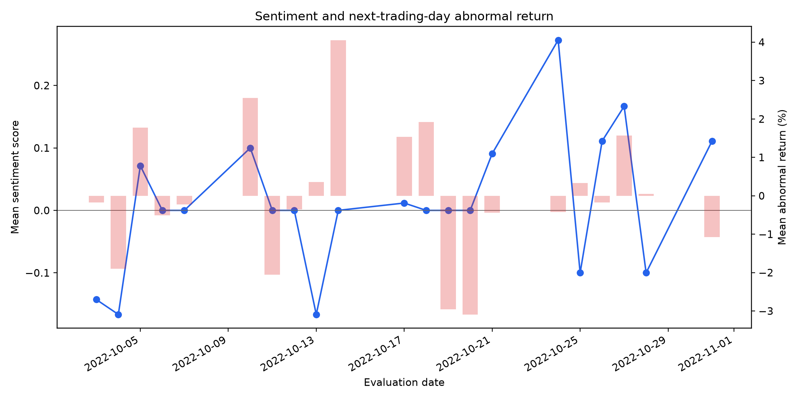
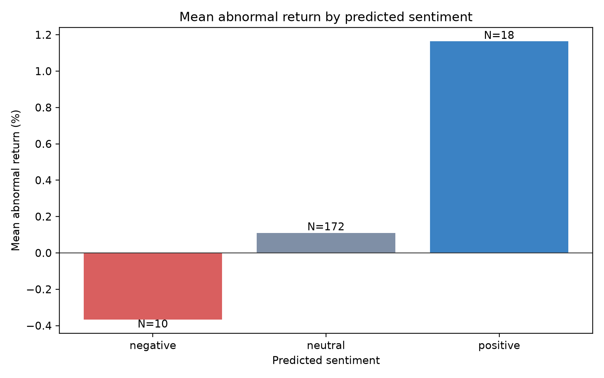

# CafeF–FinABSA Validation Report

> Báo cáo này được sinh tự động từ dữ liệu và kết quả trong repository. Các kết luận học thuật cần được kiểm tra lại sau khi model output hoàn tất.

## 1. Executive summary

Số dòng input: **208**. Số dòng prediction: **208**. Số nhãn chưa parse được: **0**.

Kết quả chính được thiết kế theo next-trading-day return và abnormal return dựa trên market model. Đây là kiểm định liên hệ ngoài mẫu, không phải bằng chứng nhân quả hay khuyến nghị đầu tư.

## 2. Prediction validation

```json
{
  "input_rows": 208,
  "prediction_rows": 208,
  "missing_predictions": 0,
  "unexpected_predictions": 0,
  "duplicate_input_ids": 0,
  "duplicate_prediction_ids": 0,
  "unknown_labels": 0,
  "label_counts": {
    "neutral": 202,
    "positive": 4,
    "negative": 2
  }
}
```

## 3. Event-study summary

| label    |   events |   mean_sentiment |   mean_return |   mean_abnormal_return |   median_abnormal_return |   mean_article_count |
|:---------|---------:|-----------------:|--------------:|-----------------------:|-------------------------:|---------------------:|
| negative |        2 |               -1 |       -1.0893 |                -0.8248 |                  -0.8248 |                1     |
| neutral  |      194 |                0 |       -0.763  |                 0.2012 |                   0.1741 |                1.299 |
| positive |        4 |                1 |        0.3088 |                 0.1323 |                   0.4615 |                1.25  |

## 4. Panel regression

| Unnamed: 0                                         |    coef |   std_err |   p_value |
|:---------------------------------------------------|--------:|----------:|----------:|
| Intercept                                          | -0.2803 |    1.1866 |    0.8133 |
| C(ticker)[T.AMD]                                   | -5.2975 |   14.2565 |    0.7102 |
| C(ticker)[T.BID]                                   |  1.6386 |    1.7063 |    0.3369 |
| C(ticker)[T.CEN]                                   |  2.4069 |    2.2224 |    0.2788 |
| C(ticker)[T.CTG]                                   |  1.1301 |    2.349  |    0.6304 |
| C(ticker)[T.DGC]                                   |  0.6507 |    2.9762 |    0.8269 |
| C(ticker)[T.DIG]                                   | -0.9622 |    3.6341 |    0.7912 |
| C(ticker)[T.DNP]                                   | -1.3602 |   10.3561 |    0.8955 |
| C(ticker)[T.DXG]                                   | -7.7002 |    4.2263 |    0.0685 |
| C(ticker)[T.EIB]                                   |  1.5188 |    4.564  |    0.7393 |
| C(ticker)[T.FTS]                                   |  0.1322 |    1.8762 |    0.9438 |
| C(ticker)[T.GAS]                                   | -0.9506 |    3.6477 |    0.7944 |
| C(ticker)[T.GEX]                                   |  0.2141 |    2.0003 |    0.9148 |
| C(ticker)[T.HAG]                                   | -2.6198 |    1.98   |    0.1858 |
| C(ticker)[T.HBC]                                   | -0.4332 |    6.6026 |    0.9477 |
| C(ticker)[T.HCM]                                   | -0.3415 |    2.8158 |    0.9035 |
| C(ticker)[T.HDB]                                   |  2.0872 |   36.569  |    0.9545 |
| C(ticker)[T.HDC]                                   | -5.9374 |    2.4916 |    0.0172 |
| C(ticker)[T.HPG]                                   | -0.663  |    1.5042 |    0.6594 |
| C(ticker)[T.HSG]                                   | -7.534  |   10.1227 |    0.4567 |
| C(ticker)[T.ICT]                                   | -0.735  |    2.1511 |    0.7326 |
| C(ticker)[T.ITA]                                   | -2.2455 |    1.3423 |    0.0943 |
| C(ticker)[T.KBC]                                   | -1.8416 |    1.3364 |    0.1682 |
| C(ticker)[T.LHG]                                   | -3.5513 |    4.9816 |    0.4759 |
| C(ticker)[T.LPB]                                   |  2.0555 |    2.1186 |    0.3319 |
| C(ticker)[T.MBS]                                   | -0.5023 |    1.8206 |    0.7826 |
| C(ticker)[T.MSH]                                   |  0.3562 |    5.4325 |    0.9477 |
| C(ticker)[T.MWG]                                   | -3.4896 |    1.3126 |    0.0078 |
| C(ticker)[T.NKG]                                   | -7.4478 |    1.707  |    0      |
| C(ticker)[T.NVL]                                   | -0.1798 |    1.6682 |    0.9142 |
| C(ticker)[T.OCB]                                   | -0.6911 |    1.3638 |    0.6123 |
| C(ticker)[T.PNJ]                                   | -2.7945 |    2.1092 |    0.1852 |
| C(ticker)[T.POW]                                   | -0.3177 |    1.5848 |    0.8411 |
| C(ticker)[T.PVD]                                   |  4.3167 |   12.1104 |    0.7215 |
| C(ticker)[T.REE]                                   | -0.5713 |    1.6876 |    0.7349 |
| C(ticker)[T.SAB]                                   |  1.5371 |    2.1983 |    0.4844 |
| C(ticker)[T.SHB]                                   |  0.7916 |    1.3222 |    0.5494 |
| C(ticker)[T.SSI]                                   | -0.0785 |    1.5113 |    0.9586 |
| C(ticker)[T.STB]                                   |  1.4646 |    9.162  |    0.873  |
| C(ticker)[T.TCB]                                   | -0.4559 |    2.343  |    0.8457 |
| C(ticker)[T.TGG]                                   | -2.0822 |    1.5986 |    0.1927 |
| C(ticker)[T.TNI]                                   | -1.3341 |    1.6645 |    0.4228 |
| C(ticker)[T.VCB]                                   | -4.3109 |    1.9044 |    0.0236 |
| C(ticker)[T.VIC]                                   |  0.4284 |    2.4304 |    0.8601 |
| C(ticker)[T.VIX]                                   | -2.0476 |    2.6596 |    0.4414 |
| C(ticker)[T.VND]                                   | -2.0885 |    1.4334 |    0.1451 |
| C(ticker)[T.VNM]                                   | -2.209  |    1.5033 |    0.1417 |
| C(ticker)[T.VPB]                                   |  0.8495 |    6.0108 |    0.8876 |
| C(ticker)[T.VPS]                                   | -2.3774 |    2.1407 |    0.2667 |
| C(ticker)[T.VRE]                                   |  1.1187 |    6.2108 |    0.8571 |
| C(ticker)[T.VVS]                                   |  9.1739 |    8.1399 |    0.2597 |
| C(target_date)[T.Timestamp('2022-10-04 00:00:00')] | -1.7659 |    2.5124 |    0.4822 |
| C(target_date)[T.Timestamp('2022-10-05 00:00:00')] |  0.7433 |    1.9522 |    0.7034 |
| C(target_date)[T.Timestamp('2022-10-06 00:00:00')] | -1.7639 |    2.0151 |    0.3814 |
| C(target_date)[T.Timestamp('2022-10-07 00:00:00')] | -0.5156 |    1.1605 |    0.6569 |
| C(target_date)[T.Timestamp('2022-10-10 00:00:00')] |  1.9149 |    1.0443 |    0.0667 |
| C(target_date)[T.Timestamp('2022-10-11 00:00:00')] | -3.7897 |    1.353  |    0.0051 |
| C(target_date)[T.Timestamp('2022-10-12 00:00:00')] | -0.6759 |    1.7647 |    0.7017 |
| C(target_date)[T.Timestamp('2022-10-13 00:00:00')] |  0.6902 |    1.3988 |    0.6217 |
| C(target_date)[T.Timestamp('2022-10-14 00:00:00')] |  4.6447 |    1.6437 |    0.0047 |
| C(target_date)[T.Timestamp('2022-10-17 00:00:00')] |  2.0972 |    0.9322 |    0.0245 |
| C(target_date)[T.Timestamp('2022-10-18 00:00:00')] |  2.0014 |    2.0668 |    0.3329 |
| C(target_date)[T.Timestamp('2022-10-19 00:00:00')] | -1.2883 |    2.4959 |    0.6057 |
| C(target_date)[T.Timestamp('2022-10-20 00:00:00')] | -2.8164 |    3.3729 |    0.4037 |
| C(target_date)[T.Timestamp('2022-10-21 00:00:00')] | -1.7624 |    1.1935 |    0.1398 |
| C(target_date)[T.Timestamp('2022-10-24 00:00:00')] | -0.3984 |    1.2502 |    0.75   |
| C(target_date)[T.Timestamp('2022-10-25 00:00:00')] |  0.5612 |    1.5384 |    0.7153 |
| C(target_date)[T.Timestamp('2022-10-26 00:00:00')] | -0.5799 |    1.107  |    0.6003 |
| C(target_date)[T.Timestamp('2022-10-27 00:00:00')] |  1.0854 |    1.2191 |    0.3733 |
| C(target_date)[T.Timestamp('2022-10-28 00:00:00')] | -0.224  |    1.4596 |    0.878  |
| C(target_date)[T.Timestamp('2022-10-31 00:00:00')] | -0.3527 |    1.1641 |    0.7619 |
| sentiment_score                                    |  0      |    1.2603 |    1      |
| negative_share                                     | -0.4822 |    1.7758 |    0.786  |
| positive_share                                     |  0.9243 |    1.7058 |    0.5879 |
| log_article_count                                  |  1.4728 |    1.208  |    0.2228 |

## 5. Data coverage

Số ngày aggregate: **21**. Số ticker có market model: **54**.

| ticker   |   alpha |    beta |   n_estimation | model_status   |
|:---------|--------:|--------:|---------------:|:---------------|
| ACB      |  0.0288 |  0.9434 |            105 | market_model   |
| AMD      | -0.6832 |  1.4887 |            105 | market_model   |
| BID      |  0.1454 |  1.4112 |            105 | market_model   |
| BIG      | -0.3924 |  0.3397 |            105 | market_model   |
| CEN      | -0.2903 |  1.1666 |            105 | market_model   |
| CTG      |  0.0958 |  1.4386 |            105 | market_model   |
| DGC      | -0.0688 |  1.5952 |            105 | market_model   |
| DIG      | -0.2028 |  1.7626 |            105 | market_model   |
| DNP      |  0.0483 | -0.0055 |             99 | market_model   |
| DXG      | -0.2254 |  1.7109 |            105 | market_model   |
| EIB      |  0.1702 |  0.1483 |            105 | market_model   |
| FLC      | -0.7855 |  1.5124 |             89 | market_model   |
| FTS      |  0.1854 |  1.8623 |            105 | market_model   |
| GAS      |  0.2293 |  1.1169 |            105 | market_model   |
| GEX      | -0.049  |  1.7771 |            105 | market_model   |
| HAG      |  0.4616 |  1.1152 |            105 | market_model   |
| HBC      |  0.0116 |  1.5022 |            105 | market_model   |
| HCM      |  0.2349 |  1.681  |            105 | market_model   |
| HDB      |  0.1528 |  1.112  |            105 | market_model   |
| HDC      | -0.0407 |  1.6777 |            105 | market_model   |
| HPG      | -0.2097 |  1.0532 |            105 | market_model   |
| HSG      | -0.1268 |  1.4914 |            105 | market_model   |
| ICT      |  0.1137 |  0.4238 |            105 | market_model   |
| ITA      | -0.5754 |  1.5134 |            105 | market_model   |
| KBC      |  0.1289 |  1.3851 |            105 | market_model   |
| LHG      | -0.1524 |  1.5908 |            105 | market_model   |
| LPB      | -0.0106 |  1.4453 |            105 | market_model   |
| MBS      |  0.1213 |  2.1671 |            105 | market_model   |
| MSH      | -0.2744 |  1.2546 |            105 | market_model   |
| MWG      |  0.0632 |  1.2326 |            105 | market_model   |

## 6. Figures





## 7. Interpretation checklist

1. Kiểm tra temporal leakage: bài sau giờ đóng cửa không được gán cho cùng phiên.
2. Kiểm tra entity linking: kết quả chính nên dùng strict/high-confidence mapping.
3. So sánh với baseline và placebo; không chỉ nhìn p-value.
4. Báo cáo effect size và khoảng tin cậy.
5. Nếu intrinsic sentiment tốt nhưng extrinsic không có tín hiệu, đó vẫn là kết quả hợp lệ của môn NLP.

## 8. Limitations

CafeF là một nguồn tin, không đại diện toàn bộ thông tin thị trường. Timestamp, entity linking, coverage của ticker và cờ adjusted price cần được kiểm tra thủ công. Kết quả quan sát không chứng minh bài báo gây ra lợi suất.

## References

[1]: https://github.com/Khoaph1709/FinABSA-Valid FinABSA-Valid repository
[2]: https://cafef.vn/ CafeF
[3]: https://github.com/thinh-vu/vnstock vnstock
